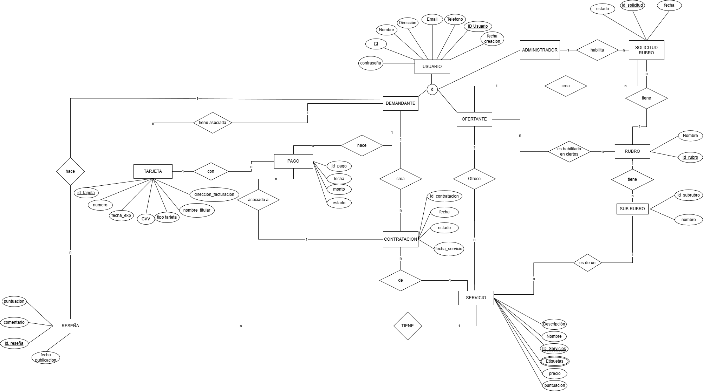

# 🛠️ ServiciosYa - Service Marketplace Backend


**Project Type:** On-Demand Services Platform (Marketplace)
**Core Tech:** Java, Spring Boot, REST API, JWT, Hibernate.

---

## 📖 Project Overview
**ServiciosYa** is a comprehensive platform connecting service providers (plumbers, electricians, tutors) with clients in real-time.

As the **Backend Lead & Project Manager**, I steered the development lifecycle from conception to deployment. My focus was on delivering a scalable, secure RESTful API while coordinating the frontend integration and timeline management.

### 🎯 Key Responsibilities
* **Technical Leadership:** Designed the monolithic architecture and database schema to support complex transactions and user interactions.
* **Project Management:** Led the agile team using Scrum methodology, managing sprints, backlog prioritization, and risk mitigation.
* **Quality Assurance:** Established coding standards and code review protocols to ensure maintainability.

---

## 🏗️ Database Architecture



The system relies on a robust relational database (PostgreSQL) modeled to ensure data integrity across complex transactions:
* **User Management:** Role-based entities (`Ofertante`, `Demandante`, `Administrador`) inheriting from a central `Usuario` table.
* **Service Lifecycle:** Detailed tracking of `Contratacion` states, from request to completion and rating.
* **Financials:** Secure handling of payment records (`Pago`) and invoice addresses.

---

## 🚀 Key Features Implemented

* **Smart Search & Filtering:** Advanced query specifications to find providers by location, category, and rating.
* **Transaction Management:** ACID-compliant service booking and status updates (Requested -> Accepted -> Completed).
* **Rating System:** Logic for calculating weighted averages for provider reputation based on `Reseña`.
* **Security Layer:** Stateless authentication using **JWT (JSON Web Tokens)**.

---

## 🛠️ Tech Stack

| Category | Technology | Usage |
| :--- | :--- | :--- |
| **Framework** | Spring Boot 3 | Rapid application development and dependency injection. |
| **Language** | Java 17 | Core logic implementation. |
| **Database** | PostgreSQL | Relational data storage via Hibernate/JPA. |
| **Security** | Spring Security + JWT | Authentication and Authorization. |
| **Docs** | Swagger UI | Interactive API documentation. |

---

## ⚡ Setup & Run

```bash
# 1. Clone the repository
git clone [https://github.com/Lochi011/serviciosya-backend.git](https://github.com/Lochi011/serviciosya-backend.git)

# 2. Configure Database
# Update application.properties with your Postgres credentials

# 3. Run the application
./mvnw spring-boot:run
```
## 👤 Author

**Santiago Lozano**
*Backend Lead | Cloud Architect | Project Manager*

* **Role:** Backend Development (Python/Lambda) & Project Management.
* **Contribution:** Designed the Serverless Architecture, implemented the API/Event Bus, and led the team integration strategies.
* **Contact:** [Santiago Lozano](https://www.linkedin.com/in/santiago-lozano-81171624b/)
